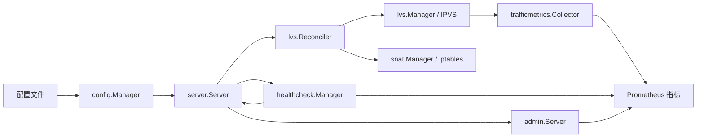

# 项目架构

ezlb 是运行在指定网络命名空间内的四层负载均衡进程。配置文件声明 VIP、协议、调度器、后端和健康检查；进程把期望状态同步到 Linux IPVS，需要 FullNAT 时另行同步 iptables SNAT 和 FORWARD 规则。

## 模块职责与边界

| 模块 | 职责 |
| --- | --- |
| `cmd/ezlb` | 解析 `start` / `once` 和网络命名空间模式，初始化日志与进程信号。 |
| `pkg/config` | 读取、校验配置；文件变化时发布已通过校验的新快照。管理端地址、指标开关与路径、日志设置需要重启。 |
| `pkg/server` | 编排启动、热加载、定期同步、就绪状态和退出清理。 |
| `pkg/healthcheck` | 按服务和后端运行 TCP/HTTP 探测；状态变化通知 server 重新同步。 |
| `pkg/lvs` | 比较期望与实际 IPVS 服务及后端，执行增删改。`exclusive` 管理整个命名空间的 IPVS 表；`shared` 仅删除当前进程记录的服务。 |
| `pkg/snat` | 为启用 FullNAT 的健康后端维护 SNAT 规则，并为相关 VIP 维护 FORWARD 放行规则。 |
| `pkg/trafficmetrics`、`pkg/metrics` | 采集 IPVS 累计计数，转换为 Prometheus counter 增量；管理流量、连接与健康指标的标签生命周期。 |
| `pkg/admin` | 提供 `/health`、`/ready` 和可配置的 Prometheus 端点。 |

## 运行流程

1. 启动时校验配置，注册健康检查，执行第一次 reconcile，然后启动配置监听和指标采集。
2. 配置变化时更新健康检查目标，按新配置 reconcile IPVS 与 SNAT，再更新采集器；健康状态变化也会触发 reconcile。每 30 秒再同步一次以纠正外部漂移。
3. 最近一次数据面同步成功时 `/ready` 返回 200，否则返回 503。`/health` 报告进程和已注册后端的健康状态。
4. `start` 收到退出信号时，按 `cleanup_on_exit` 决定是否清理规则；`once` 同步一次并保留规则。

新注册的后端在首次探测前暂按健康处理；探测达到失败阈值后从 IPVS 移除。此时健康指标继续暴露 `0`，流量与连接指标可清理。后端从配置删除时，健康指标也应删除。

## 测试层次

| 层次 | 命令 | 验证内容 |
| --- | --- | --- |
| 单元 | `make test` | 配置校验、规则转换、指标操作和模块内部行为；使用 fake IPVS/SNAT。 |
| 集成 | `make test`；Linux 隔离命名空间内 `make test-linux` | 配置、健康状态、reconcile、指标等模块交互；Linux 目标另验证真实内核接口。 |
| e2e | Linux 隔离命名空间内 `make test-e2e`；或 `make test-docker` | 启动真实二进制，核对 IPVS、iptables 和 HTTP 端点。`make test-compose` 再验证实际转发。 |

真实 IPVS 测试会清理当前命名空间的规则，只能在一次性命名空间或测试容器中运行；入口要求 `EZLB_TEST_EXCLUSIVE_NETNS=1`。
